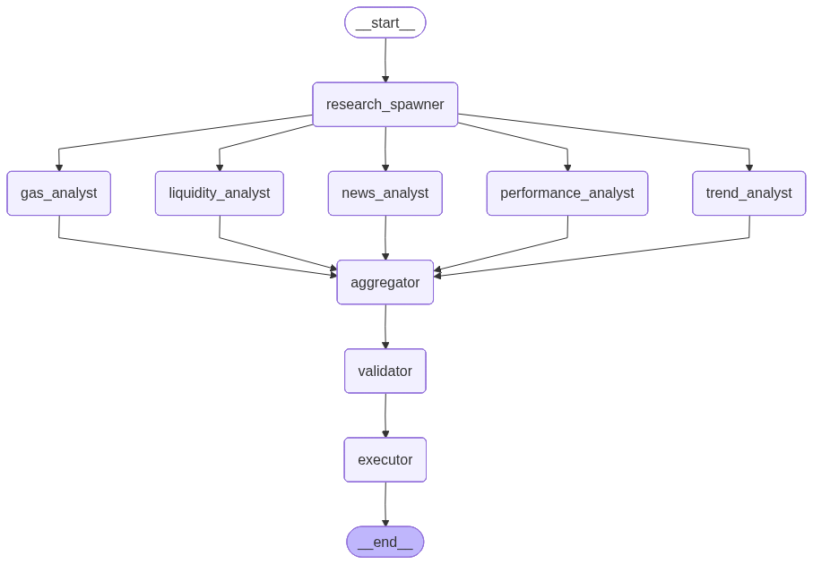

# Agentic Testnet Trading System

## Overview

This project is an event-driven, agentic cryptocurrency trading simulation platform built for test networks.

The system executes simulated trading strategies against:

- **Solana Devnet** (via `solana-py`)
- **Ethereum Sepolia** (via `AgentKit/CDP`)
- **Avalanche Fuji** (via `AgentKit/CDP`)

Real market data is used to generate trading signals, while all trade execution occurs on testnets using a **three-wallet USDC strategy** to avoid risking real capital.

---

## Goals

- Evaluate AI-generated trading strategies safely
- Simulate multi-chain portfolio management
- Test autonomous trading workflows
- Support long-running blockchain operations
- Maintain reproducibility and auditability

---

## Core Technologies

### AI / Workflow

- LangGraph
- LangChain
- **Groq** (via LangChain-Groq)
- **LangSmith** (for observability)
- **Coinbase AgentKit** (for EVM execution)

### Blockchain

- **Solana Python SDK** (`solana-py`)
- **Coinbase CDP SDK**
- **web3.py** (for deterministic validations)

### Infrastructure

- Python 3.12+
- **SQLite (aiosqlite)** for persistent trade tracking

---

## Architecture

### Multi-Agent Parallel Workflow
The system uses a decoupled LangGraph architecture to separate reasoning from execution. It utilizes a parallel fan-out structure where specialized subagents provide context to a central aggregator.



#### Workflow Nodes
- **`research_spawner`**: The entry point that fans out into parallel analysis nodes.
- **Analyst Nodes (`gas`, `news`, `trend`, `performance`)**: Specialized subagents that run in parallel to analyze network fees, macro sentiment, technical trends, and portfolio PnL, respectively.
- **`aggregator`**: Consumes reports from all specialized subagents to generate a final, high-conviction `TradePlan`.
- **`validator`**: A deterministic node that enforces balance constraints, maximum trade limits, and slippage guardrails.
- **`executor`**: Dispatches validated actions to chain-specific wallet adapters and records them in the database.

### Background Services
- **Market Watcher (`src/services/market_watcher.py`):** Aggregates price snapshots and triggers the agent loop.
- **Transaction Monitor (`src/services/transaction_monitor.py`):** A parallel service that polls the blockchain to update the status of `PENDING` trades in SQLite.

---

## Design Principles

### Stateless Non-Blocking Execution
To handle flaky testnets, the agent loop completes immediately after submitting a transaction. The `TransactionMonitor` handles the asynchronous confirmation, allowing the agent to stay responsive to new signals.

### Singleton Wallet Management
The `WalletManager` is a singleton ensuring that wallet keys and initialized providers are shared across the application, preventing redundant initialization and race conditions.

### SDK Thread Isolation
Calls to loop-heavy SDKs (like Coinbase AgentKit) are offloaded to separate threads using `asyncio.to_thread` to prevent event loop conflicts.

### Centralized Persistence
All SQL queries are centralized in `src/persistence/queries.py` and use parameterized queries to prevent injection from LLM-generated rationale strings.

---

## Wallet Management & Capital

### Three-Wallet Strategy
The system maintains three distinct wallets, one for each supported chain.
- Each wallet uses **USDC** as its base "bank" currency.
- **Gas Requirements:** Each wallet must be funded with a small amount of the chain's native testnet token (SOL, ETH, or AVAX) to cover gas fees for swaps.
- Trades are simulated by swapping USDC for the target asset and back.

### Initialization: Two-Stage Polling
1. **Stage 1: Funding Poll:** The main script polls for native/USDC balances. It will wait indefinitely until at least one wallet is funded. Instructions are provided in `WALLETS.md`.
2. **Stage 2: Market Poll:** Once funds are detected, the system enters its active loop, polling market data providers for signals to trigger the Aggregator Agent.

---

## Development

### Prerequisites

- Python 3.12+
- [uv](https://github.com/astral-sh/uv)
- `libffi-dev` (required for `cffi` build)

### Install

```bash
# Install dependencies and setup virtual environment
make install
```

### Visualization
Generate a visual map of the trading graph:
```bash
make graph
```

### Run Full System
```bash
uv run src/workflows/main.py
```

### Run Quality Checks
```bash
# Formatter, Ruff, Pylint (10/10), Mypy, and Pytest
make check
```

---

## Future Roadmap & Backlog

### Roadmap
- **Phase 1: Foundation** (Completed)
- **Phase 2: Agentic Trading** (Completed)
- **Phase 3: Real Execution & Persistence** (Completed)
- **Phase 4: Advanced Features** (Next)

### Backlog (v2)
- **Contemporary News Integration:** Integrate a news aggregator (e.g., CryptoPanic) to provide macro context to the Aggregator.
- **Stateful Resume:** Utilize LangGraph checkpointers (SqliteSaver) to interrupt and resume specific workflow threads upon transaction confirmation.
- **Technical Analysis Tooling:** Pre-calculate indicators (RSI, MACD, Moving Averages) to provide compressed technical context to the LLM.
- **RPC Connectivity:** Automatic RPC endpoint fallbacks for chain connectivity.
- **Backtesting & Simulation:** Develop an engine to evaluate strategies against historical data.
